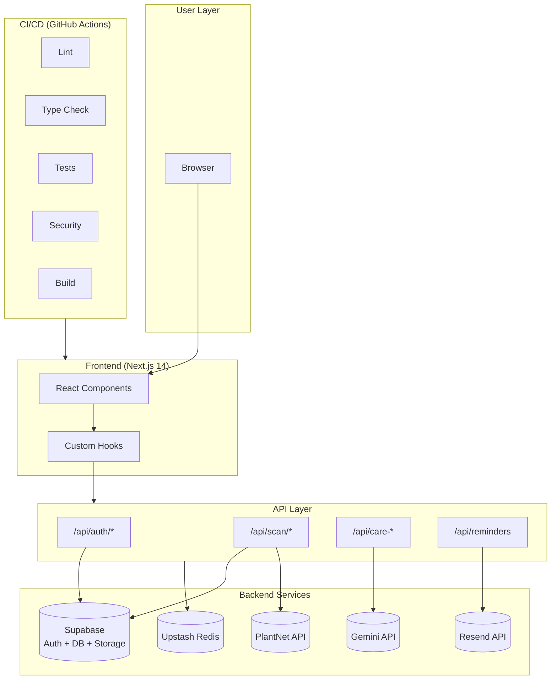

# Bloom - Cut Flower Care Tracker

**Students:** Hemang Murugan | Feng Hua Tan  
**Course:** CS7180 - SpTp: AI Assisted Coding (Vibe Coding)  
**Project:** Production Application with Claude Code Mastery  

**🌸 Live Site:** [https://bloom-flowering.vercel.app](https://bloom-flowering.vercel.app)  
**📁 Repository:** [github.com/karyn-tan/Bloom](https://github.com/karyn-tan/Bloom)  
**📝 Blog Post #1:** [dev.to/hemang_murugan_a9b77a329a/building-bloom-how-ai-assisted-development-changed-my-workflow-259i](https://dev.to/hemang_murugan_a9b77a329a/building-bloom-how-ai-assisted-development-changed-my-workflow-259i)  
**📝 Blog Post #2:** 
[https://medium.com/@karyntaan/building-bloom-how-ai-assisted-development-changed-my-workflow-4e5e4e4f65b1](https://medium.com/@karyntaan/building-bloom-how-ai-assisted-development-changed-my-workflow-4e5e4e4f65b1)  
**✅ Grading Checklist:** [`PROJECT3_CHECKLIST.md`](PROJECT3_CHECKLIST.md) - Complete rubric with status for TAs

---

## Architecture



---

## Grading Checklist

### Category 1: Application Quality

- [x] Production-ready application (CI/CD passing)
- [x] 2+ user roles (Maya - casual, Priya - hobbyist)
- [x] Real use case (flower care identification - new idea)
- [x] Portfolio quality (15 MVP features, neo-brutalist design)
- [x] Deployed on Vercel https://bloom-flowering.vercel.app

**Evidence:** See `PROJECT3_CHECKLIST.md` for full details

---

### Category 2: Claude Code Mastery

#### W10: CLAUDE.md & Memory

- [x] Comprehensive CLAUDE.md with conventions
- [x] @imports for modular organization (`@project_memory/bloom_prd.md`)
- [x] Auto-memory usage (session persistence)
- [x] CLAUDE.md evolution visible in git history
- [x] Architecture decisions documented (8 decisions)
- [x] Testing strategy documented (TDD workflow)

**Evidence:** [`CLAUDE.md`](CLAUDE.md)

#### W12: Custom Skills (minimum 2)

- [x] Skill 1: `tdd-feature` - TDD workflow with RED/GREEN/REFACTOR
- [x] Skill 2: `create-pr` - PR creation with C.L.E.A.R.
- [x] Skill v1→v2 iteration (auto-detection, session logging)
- [x] Evidence: 3 tasks in SESSION_LOG.md

**Evidence:** [`.claude/skills/`](.claude/skills/) and [`.claude/skills/tdd-feature`](.claude/skills/tdd-feature) for v1→v2 iteration and proof of usage in session log

#### W12: Hooks (minimum 2)

- [x] Hook 1: PreToolUse hook (blocks Claude from touching protected files like .env files and any SQL migration files)
- [x] Hook 2: PostToolUse hook (automatically runs the related test file whenever Claude edits a TypeScript file. So if Claude edits flowers.ts, it will immediately run flowers.test.ts and if the tests fail, it prints a warning and returns an error code to signal something broke)
- [x] Quality-enforcement hook which is our Hook 2

**Evidence:** [`.claude/settings.json`](.claude/settings.json)

#### W12: MCP Servers (minimum 1)

- [x] Supabase MCP configured (HTTP)
- [x] Playwright MCP configured (command)
- [x] GitHub MCP configured (command)
- [x] Configuration shared via `.mcp.json`

**Evidence:** [`.mcp.json`](.mcp.json), [`.claude/settings.json`](.claude/settings.json), [`hw5-deliverables/MCP_DEMONSTRATION.md`](hw5-deliverables/MCP_DEMONSTRATION.md)

#### W12-W13: Agents (minimum 1)

- [x] Agent 1: `test-writer` (writes Vitest unit/integration tests and Playwright E2E tests following the project's TDD red-green-refactor workflow)
- [x] Agent 2: `security-reviewer` (reviews code for security vulnerabilities in this Next.js + Supabase project)
- [x] Evidence in PR#12 and PR#13

**Evidence:** [`.claude/agents/`](.claude/agents/), [`PR#12`](https://github.com/karyn-tan/Bloom/pull/12) and [`PR#13`](https://github.com/karyn-tan/Bloom/pull/13)

#### W12: Parallel Development

- [x] Worktree usage evidence documented
- [x] 2+ features in parallel (health-visualization + email-reminders)
- [x] Interleaved commits visible in git history
- [x] Shared base commit (2bc3db1)

**Evidence:** [`WORKTREE_EVIDENCE.md`](WORKTREE_EVIDENCE.md)

#### W12: Writer/Reviewer Pattern + C.L.E.A.R.

- [x] 2+ PRs using writer/reviewer pattern
- [x] C.L.E.A.R. framework applied (Context, Logic, Evidence, Architecture, Risk)
- [x] AI disclosure metadata in PRs

**Evidence:** [`PR#12`](https://github.com/karyn-tan/Bloom/pull/12) and [`PR#13`](https://github.com/karyn-tan/Bloom/pull/13)

---

### Category 3: Testing & TDD (W11)

- [x] TDD red-green-refactor pattern (3+ features)
- [x] Failing tests committed before implementation ([RED] in git log)
- [x] Unit + integration tests (255+ tests, 40+ files)
- [x] E2E tests (Playwright configured)
- [x] 70%+ test coverage (70.74% lines, 87.32% branch)

**Verify:** `npm run test:ci`

**Evidence:** `git log --grep="RED\|GREEN\|refactor"` (see [TDD Proof 1](screenshots/project3/tdd-proof-1.png) and [TDD Proof 2](screenshots/project3/tdd-proof-2.png)) and `src/**/*.test.ts`

---

### Category 4: CI/CD & Production (W14)

#### CI/CD Pipeline (8 stages)

- [x] Lint (ESLint + Prettier)
- [x] Type checking (tsc --noEmit)
- [x] Unit and integration tests
- [x] Security scan (npm audit)
- [x] AI PR review (C.L.E.A.R. framework)
- [x] Build (Next.js production)
- [x] E2E tests (Playwright)
- [x] Production deploy (configured, needs manual Vercel setup)

**Evidence:** [`.github/workflows/ci.yml`](.github/workflows/ci.yml), [`.github/workflows/pr-review.yml`](.github/workflows/pr-review.yml)

#### Security Gates (4+ required)

- [x] Gate 1: Pre-commit secrets detection (Gitleaks)
- [x] Gate 2: Dependency scanning (npm audit in CI)
- [x] Gate 3: SAST tool (CodeQL)
- [x] Gate 4: Security acceptance criteria (in CLAUDE.md)
- [x] OWASP Top 10 awareness (in CLAUDE.md)

**Evidence:** [`.github/workflows/security.yml`](.github/workflows/security.yml), [`CLAUDE.md`](CLAUDE.md)

---

### Category 5: Team Process

- [x] 2 sprints documented (planning + retrospective each)
- [x] Sprint planning with acceptance criteria
- [x] Sprint retrospectives with metrics
- [x] GitHub Issues with acceptance criteria ([`ISSUES.md`](ISSUES.md) - 12 issues)
- [x] Branch-per-issue workflow (`feat/health-visualization`, `feat/email-reminders`)
- [x] Async standups (3+ per sprint, documented in retros)
- [x] C.L.E.A.R. framework in reviews
- [ ] Peer evaluations (end of project)

**Evidence:** [`sprints/`](sprints/) (4 files), [`ISSUES.md`](ISSUES.md)

---

### Category 6: Documentation & Demo

- [x] Clear README with Mermaid diagram (this file)
- [x] Comprehensive PROJECT3_CHECKLIST.md
- [x] Individual reflections (500 words each)
  - [x] Hemang: [`REFLECTION-hemang.md`](REFLECTION-hemang.md)
  - [x] Feng Hua: [`REFLECTION-fenghua.md`](REFLECTION-fenghua.md)
- [x] Published blog post (dev.to) - [Building Bloom: How AI-Assisted Development Changed My Workflow](https://dev.to/hemang_murugan_a9b77a329a/building-bloom-how-ai-assisted-development-changed-my-workflow-259i)
- [ ] 5-10 min video demo

---

## Quick Verification

```bash
# Run tests (255+ passing, 70%+ coverage)
npm run test:ci

# Verify TDD pattern
git log --oneline --all --grep="RED\|GREEN\|refactor" -15

# Check worktrees
git worktree list

# Verify skills
ls .claude/skills/

# Check MCP
cat .mcp.json

# View sprint documents
ls sprints/
```

---

## Evidence Map

| Requirement       | Location                                                                                         |
| ----------------- | ------------------------------------------------------------------------------------------------ |
| CLAUDE.md         | [`CLAUDE.md`](CLAUDE.md)                                                                         |
| Custom Skills     | [`.claude/skills/`](.claude/skills/)                                                             |
| Hooks & MCP       | [`.claude/settings.json`](.claude/settings.json), [`.mcp.json`](.mcp.json)                       |
| Agents            | [`.claude/agents/`](.claude/agents/)                                                             |
| Worktree Evidence | [`WORKTREE_EVIDENCE.md`](WORKTREE_EVIDENCE.md)                                                   |
| Sprint Docs       | [`sprints/`](sprints/)                                                                           |
| GitHub Issues     | [`ISSUES.md`](ISSUES.md)                                                                         |
| CI/CD Workflows   | [`.github/workflows/`](.github/workflows/)                                                       |
| Tests             | `src/**/*.test.ts`                                                                               |
| Reflections       | [`REFLECTION-hemang.md`](REFLECTION-hemang.md), [`REFLECTION-fenghua.md`](REFLECTION-fenghua.md) |
| Full Checklist    | [`PROJECT3_CHECKLIST.md`](PROJECT3_CHECKLIST.md)                                                 |

---

## Tech Stack

- **Framework:** Next.js 14 (App Router)
- **Language:** TypeScript (strict mode)
- **Auth + DB:** Supabase (Auth, PostgreSQL, RLS)
- **AI:** Gemini 1.5-flash (care tips), PlantNet (identification)
- **Email:** Resend
- **Rate Limiting:** Upstash Redis
- **Testing:** Vitest + Playwright
- **CI/CD:** GitHub Actions

---

## Getting Started

```bash
npm install
npm run dev
npm test
npm run test:ci
```

---

_Last Updated: April 20, 2026_
