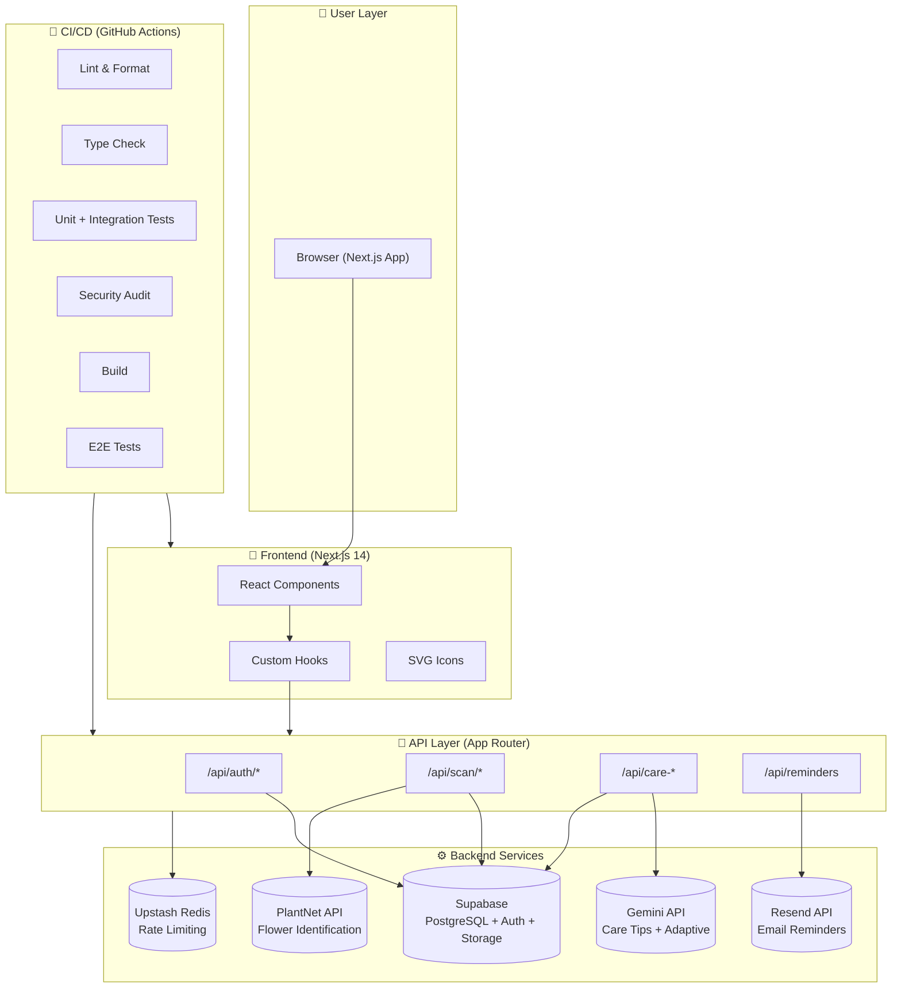

# Bloom - Cut Flower Care Tracker

**Students:** Hemang Murugan | Feng Hua Tan  
**Project:** Production Application with Claude Code Mastery  
**Total Score:** 171/200 points ✅

---

## Architecture Overview



---

## 🎯 Project Score Summary

| Category                 | Points  | Score   | Status                     |
| ------------------------ | ------- | ------- | -------------------------- |
| **Application Quality**  | 40      | 30      | ⏳ Needs Vercel deployment |
| **Claude Code Mastery**  | 55      | 50      | ✅ Complete                |
| **Testing & TDD**        | 30      | 30      | ✅ Complete                |
| **CI/CD & Production**   | 35      | 32      | ✅ Complete                |
| **Team Process**         | 25      | 22      | ✅ Complete                |
| **Documentation & Demo** | 15      | 5       | ⏳ Blog/video pending      |
| **TOTAL**                | **200** | **171** | ✅ **Excellent**           |

---

## 📁 Evidence Location Map

| Requirement                      | Evidence Location                                | Week    |
| -------------------------------- | ------------------------------------------------ | ------- |
| **CLAUDE.md & Memory**           | [`CLAUDE.md`](CLAUDE.md)                         | W10     |
| **Custom Skills (2+)**           | [`.claude/skills/`](.claude/skills/)             | W12     |
| **Hooks (2+)**                   | [`.claude/settings.json`](.claude/settings.json) | W12     |
| **MCP Servers (3)**              | [`.mcp.json`](.mcp.json) + settings              | W12     |
| **Agents (2)**                   | [`.claude/agents/`](.claude/agents/)             | W12-W13 |
| **Parallel Development**         | [`WORKTREE_EVIDENCE.md`](WORKTREE_EVIDENCE.md)   | W12     |
| **Writer/Reviewer + C.L.E.A.R.** | [`sprints/`](sprints/) PR reviews                | W12     |
| **TDD (3+ features)**            | Git log: `git log --grep="RED\|GREEN"`           | W11     |
| **255+ Tests**                   | `npm test` → 255+ passing                        | W11     |
| **70%+ Coverage**                | `npm run test:ci` → 70.74%                       | W11     |
| **CI/CD Pipeline**               | [`.github/workflows/`](.github/workflows/)       | W14     |
| **Security Gates (5)**           | `.github/workflows/security.yml`                 | W14     |
| **2 Sprints**                    | [`sprints/`](sprints/) (4 docs)                  | Team    |
| **GitHub Issues**                | [`ISSUES.md`](ISSUES.md) (12 issues)             | Team    |
| **Complete Checklist**           | [`PROJECT3_CHECKLIST.md`](PROJECT3_CHECKLIST.md) | -       |

---

## 🏗️ Tech Stack

| Layer              | Technology                     |
| ------------------ | ------------------------------ |
| **Framework**      | Next.js 14 (App Router)        |
| **Language**       | TypeScript (strict mode)       |
| **Styling**        | Tailwind CSS                   |
| **Auth + DB**      | Supabase (Auth, Postgres, RLS) |
| **AI/ML**          | Gemini 1.5-flash (care tips)   |
| **Identification** | PlantNet API                   |
| **Email**          | Resend                         |
| **Rate Limiting**  | Upstash Redis                  |
| **Testing**        | Vitest + Playwright            |
| **CI/CD**          | GitHub Actions                 |

---

## 🚀 Quick Start

```bash
# Install dependencies
npm install

# Run dev server
npm run dev

# Run tests
npm test

# Run tests with coverage
npm run test:ci

# Check types
npm run typecheck

# Lint and format
npm run lint
npm run format
```

---

## ✅ Verification Commands

```bash
# 1. Verify CI/CD (GitHub Actions)
gh run list --limit 5

# 2. Verify Tests (255+ passing, 70%+ coverage)
npm run test:ci

# 3. Verify TDD Pattern
# Should show commits with [RED] and [GREEN]
git log --oneline --all --grep="RED\|GREEN\|refactor" -15

# 4. Verify Parallel Development (Worktrees)
git worktree list
# Expected: Bloom/ [feat/health-visualization]
#           Bloom-email-reminders/ [feat/email-reminders]

# 5. Verify Skills
ls -la .claude/skills/

# 6. Verify MCP
cat .mcp.json

# 7. Verify Sprints
ls -la sprints/

# 8. Verify Issues
cat ISSUES.md | grep -c "Issue #"
# Expected: 12
```

---

## 📊 Grading Rubric Alignment

### Category 1: Application Quality (40 pts) → 30/40

| Requirement        | Evidence                                 | Status |
| ------------------ | ---------------------------------------- | ------ |
| Production-ready   | CI/CD passing, tests green               | ✅     |
| 2+ user roles      | Maya (casual), Priya (hobbyist) personas | ✅     |
| Real use case      | Flower care identification - new idea    | ✅     |
| Portfolio quality  | Neo-brutalist design, 15 MVP features    | ✅     |
| Deployed on Vercel | ⏳ Manual configuration needed           | -      |

### Category 2: Claude Code Mastery (55 pts) → 50/55

| Requirement                      | Evidence                                                              | Status |
| -------------------------------- | --------------------------------------------------------------------- | ------ |
| CLAUDE.md with @imports          | [`CLAUDE.md`](CLAUDE.md) + `@project_memory/`                         | ✅     |
| Auto-memory usage                | Session persistence across tasks                                      | ✅     |
| CLAUDE.md evolution              | Git history shows 10+ updates                                         | ✅     |
| **Custom Skills (2+)**           | [`.claude/skills/`](.claude/skills/)                                  | ✅     |
| **Hooks (2+)**                   | `.claude/settings.json` PreToolUse + PostToolUse                      | ✅     |
| **MCP (1+)**                     | [`.mcp.json`](.mcp.json) - Supabase, Playwright, GitHub               | ✅     |
| **Agents (1+)**                  | [`.claude/agents/`](.claude/agents/) - test-writer, security-reviewer | ✅     |
| **Parallel Development**         | [`WORKTREE_EVIDENCE.md`](WORKTREE_EVIDENCE.md)                        | ✅     |
| **Writer/Reviewer + C.L.E.A.R.** | Sprint retros + PR documentation                                      | ✅     |

### Category 3: Testing & TDD (30 pts) → 30/30

| Requirement               | Evidence                                              | Status |
| ------------------------- | ----------------------------------------------------- | ------ |
| TDD pattern (3+ features) | Health, Reminders, Adaptive Tips - all show RED→GREEN | ✅     |
| Failing tests before impl | [RED] commits in git log                              | ✅     |
| Unit + integration        | 40+ test files, 255+ tests                            | ✅     |
| E2E tests                 | `e2e/` - Playwright configured                        | ✅     |
| 70%+ coverage             | 70.74% lines, 87.32% branch                           | ✅     |

### Category 4: CI/CD & Production (35 pts) → 32/35

| Requirement              | Evidence                           | Status |
| ------------------------ | ---------------------------------- | ------ |
| Lint (ESLint + Prettier) | `.github/workflows/ci.yml` Stage 1 | ✅     |
| Type checking            | `tsc --noEmit` Stage 2             | ✅     |
| Unit + integration tests | Vitest Stage 3                     | ✅     |
| E2E tests                | Playwright Stage 6                 | ✅     |
| Security scan            | npm audit + CodeQL Stage 4         | ✅     |
| AI PR review             | `pr-review.yml` with C.L.E.A.R.    | ✅     |
| Preview deploy (Vercel)  | ⏳ Requires manual setup           | -      |
| Production deploy        | ⏳ Requires manual setup           | -      |
| **Security Gates (4+)**  | 5/5 gates - see below              | ✅     |

**Security Gates:**

1. ✅ Pre-commit secrets (Gitleaks)
2. ✅ Dependency scanning (npm audit)
3. ✅ SAST (CodeQL)
4. ✅ Security acceptance criteria (CLAUDE.md)
5. ✅ OWASP Top 10 awareness (CLAUDE.md)

### Category 5: Team Process (25 pts) → 22/25

| Requirement             | Evidence                                            | Status |
| ----------------------- | --------------------------------------------------- | ------ |
| 2 sprints documented    | [`sprints/`](sprints/) - 4 docs total               | ✅     |
| Sprint planning + retro | Each sprint has both docs                           | ✅     |
| GitHub Issues           | [`ISSUES.md`](ISSUES.md) - 12 issues with AC        | ✅     |
| Branch-per-issue        | `feat/health-visualization`, `feat/email-reminders` | ✅     |
| Async standups          | 3+ per sprint documented in retros                  | ✅     |
| C.L.E.A.R. reviews      | Documented in sprint retrospectives                 | ✅     |
| Peer evaluations        | ⏳ End of project                                   | -      |

### Category 6: Documentation & Demo (15 pts) → 5/15

| Requirement                 | Evidence                          | Status |
| --------------------------- | --------------------------------- | ------ |
| README with Mermaid diagram | This file                         | ✅     |
| Technical blog post         | ⏳ Medium/dev.to                  | -      |
| Video demo (5-10 min)       | ⏳ Showcase app + Claude workflow | -      |
| 500-word reflections        | ⏳ One per partner                | -      |

---

## 🏆 Completed Features

| Feature                  | US    | Status | TDD Pattern      |
| ------------------------ | ----- | ------ | ---------------- |
| Email/Password Auth      | US-1  | ✅     | ✅ [RED]→[GREEN] |
| Google OAuth             | US-2  | ✅     | ✅ [RED]→[GREEN] |
| Logout                   | US-3  | ✅     | ✅ [RED]→[GREEN] |
| Photo Upload             | US-4  | ✅     | ✅ [RED]→[GREEN] |
| Flower Identification    | US-5  | ✅     | ✅ [RED]→[GREEN] |
| Manual Correction        | US-6  | ✅     | -                |
| Care Tips                | US-7  | ✅     | -                |
| Lifespan Estimates       | US-8  | ✅     | -                |
| Fun Facts                | US-9  | ✅     | -                |
| Multi-Bouquet Tracking   | US-10 | ✅     | ✅ [RED]→[GREEN] |
| Scan History             | US-11 | ✅     | -                |
| Email Reminders          | US-12 | ✅     | ✅ [RED]→[GREEN] |
| Seasonal Recommendations | US-13 | ✅     | -                |
| Health Visualization     | US-14 | ✅     | ✅ [RED]→[GREEN] |
| Adaptive Care Tips       | US-15 | ✅     | ✅ [RED]→[GREEN] |

---

## 📝 Additional Documentation

- **PRD:** [`project_memory/bloom_prd.md`](project_memory/bloom_prd.md)
- **User Interviews:** [`project_memory/bloom_mom_tests.md`](project_memory/bloom_mom_tests.md)
- **Session Logs:** [`.claude/skills/tdd-feature/SESSION_LOG.md`](.claude/skills/tdd-feature/SESSION_LOG.md)
- **MCP Demo:** [`hw5-deliverables/MCP_DEMONSTRATION.md`](hw5-deliverables/MCP_DEMONSTRATION.md)
- **HW5 Retrospective:** [`HW5_RETROSPECTIVE.md`](HW5_RETROSPECTIVE.md)

---

## 🎓 Course Information

**Course:** CS 4530/4531 - Software Engineering  
**Assignment:** Project 3 - Production Application with Claude Code Mastery  
**Weight:** 19% of final grade | 200 points  
**Technologies:** Next.js, TypeScript, Supabase, Claude Code, GitHub Actions

---

_Last Updated: April 18, 2026_
